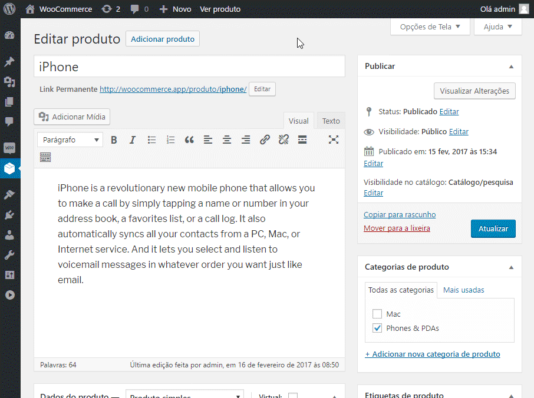

    

### Módulo para plataforma WooCommerce

Versão do módulo: 1.0.3

Compatibilidade com WooCommerce: **2.6.x** ao **3.0.8**

Links úteis:

- [Painel administrativo][2]
- [suporte@freterapido.com][3]

-------------

### IMPORTANTE
A Frete Rápido não mantem e/ou oferece suporte para a integração com o **WooCommerce**, apenas disponibilizamos um módulo de integração padrão que atente a maioria dos e-commerces que utilizam esta plataforma.

Para qualquer modificação no módulo baseada no modelo de negócio do seu e-commerce, nós disponibilizamos aqui o código fonte do módulo integrado a (API do Frete Rápido) e aqui [neste link][7] você encontra a documentação de integrações e modificações do **WooCommerce**.

--------------

### Instalação

>**ATENÇÃO!** Recomendamos que seja feito backup da sua loja antes de realizar qualquer instalação. A instalação desse módulo é de inteira responsabilidade do lojista.

- [Baixe aqui a última versão][4], descompacte o conteúdo do arquivo zip dentro da pasta "wp-content/plugins", ou instale usando o instalador de plugins do WordPress.
- Ative o plugin.

")

----------

### Configurações

É necessário realizar algumas configurações na sua loja para obter total usabilidade do plugin **Frete Rápido**.

#### 1. Configurações do módulo:

- Agora, configure a nova forma de entrega: **WooCommerce** > **Configurações** > **Entrega** > **Frete Rápido** (conforme imagem abaixo).

- **Habilitar/Desabilitar:** Habilita ou desabilita o módulo conforme sua necessidade.
- **CNPJ:** CNPJ da sua empresa conforme registrado no Frete Rápido.
- **Resultados:** Define como deseja receber as cotações.
- **Limite:** Permitir limitar, até 20, a quantidade de cotações que deseja apresentar ao visitante.
- **Exibir Frete Grátis no frete mais barato:** Apresenta para o cliente da loja o frete mais barato como **Frete Grátis**.
- **Valor Mínimo Frete Grátis:**  Define o valor mínimo para ativar a regra de **Frete grátis**. Para valor **indefinido**, informe **0**.
- **Comprimento padrão (cm):** Define a comprimento padrão dos produtos que não tiverem altura informada.
- **Largura padrão (cm):** Define a largura padrão dos produtos que não tiverem altura informada.
- **Altura padrão (cm):** Define a altura padrão dos produtos que não tiverem altura informada.
- **Token:** Token de integração da sua empresa disponível no [Painel administrativo do Frete Rápido][2] > Empresa > Integração.

#### 2. Medidas, peso e prazo:

- Para calcular o frete precisamos saber as medidas das embalagens de cada produto e peso. Você precisa informá-los nas configurações do seu produto.

> **Obs:** Você também pode configurar o prazo de fabricação do produto, caso haja. Ele será acrescido no prazo de entrega do frete.

> **Atenção:** Considerar as dimensões e peso do produto com a embalagem pronta para envio/postagem.
> É obrigatório ter o peso configurado em cada produto para que seja possível cotar o frete de forma eficiente. As dimensões podem ficar em branco, e, neste caso, serão utilizadas as medidas padrões informadas na configuração do plugin.
> Nós recomendamos que cada produto tenha suas próprias configurações de peso e dimensões para que você tenha seu frete cotado com mais precisão.

#### 3. Categorias
- Cada categoria da sua loja precisa estar relacionada com as categorias do Frete Rápido. Você pode configurar isso em: **Produtos** > **Categorias**.

> **Obs:** Nem todas as categorias da sua loja podem coincidir com a relação de categorias do Frete Rápido, mas é possível relacioná-las de forma ampla.

> **Exemplo 1**: Moda feminina -> Vestuário

> **Exemplo 2**: CDs -> CD / DVD / Blu-Ray

> **Exemplo 3**: Violões -> Instrumento Musical

--------

### Observações gerais:
1. Para obter cotações dos Correios é necessário configurar o seu contrato com os Correios no [Painel administrativo do Frete Rápido][2] > Empresa > Integração.
2. Esse módulo atende cotações apenas para destinatários Pessoa Física.

----------

### Cálculo do frete na página do produto

Para cálculo do frete na página do produto, você precisa utilizar o plugin específico do Frete Rápido. Para instalá-lo, basta acessar sua documentação em [freterapido_woocommerce_2.6_shipping_product_page][6].

--------

### Contribuições
Encontrou algum bug ou tem sugestões de melhorias no código? Sensacional! Não se acanhe, nos envie um *pull request* com a sua alteração e ajude este projeto a ficar ainda melhor.

1. Faça um "Fork"
2. Crie seu branch para a funcionalidade: ` $ git checkout -b feature/nova-funcionalidade`
3. Faça o commit suas modificações: ` $ git commit -am "adiciona nova funcionalidade"`
4. Faça o push para a branch: ` $ git push origin feature/nova-funcionalidade`
5. Crie um novo Pull Request

--------

### Licença
[MIT][5]

[2]: https://freterapido.com/painel/?origin=github_woocommerce_freterapido "Painel do Frete Rápido"
[3]: mailto:suporte@freterapido.com "E-mail para a galera super gente fina :)"
[4]: https://github.com/freterapido/freterapido_woocommerce_2.6/archive/master.zip
[5]: https://github.com/freterapido/freterapido_woocommerce/blob/master/LICENSE
[6]: https://github.com/freterapido/freterapido_woocommerce_2.6_shipping_product_page
[7]: https://woocommerce.com/developers/
